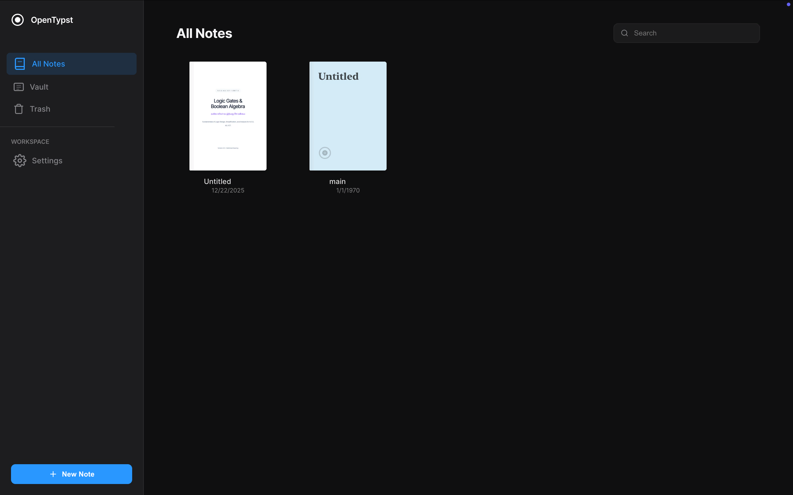

  

# Chamath Thiwanka

I bridge the gap between frontier models and the software people actually use every day.

**Founder, [Cortana (Pvt.) Ltd.](https://cortana.lk)** · Sri Lanka
Building with LLMs since the GPT-3 API era (OpenAI researcher credits, pre-ChatGPT).

---

## ◆ In production

### Black Rock Aggregate — quarry operations platform

Built for **Black Rock Aggregate (Pvt.) Ltd.** Gate dispatch, live 3D fleet tracking, multi-partner treasury, and print-perfect vouchers. An entry made at the weighbridge on a phone appears on the owner's dashboard in real time. A mobile PWA for field operators; a realtime financial console for partners.

<!-- UNLOCK-1 · case-studies repo public + demo video ready → uncomment:
→ **[Case study](https://github.com/chama-x/case-studies)** · **[Watch the 60s demo]({{VIDEO_URL}})**
-->

> *The 3D engine in this system is the same one that runs my agent research, below.*

---

## ◆ Open tools

<table>
  <tr>
    <td width="50%" valign="top">
      
      
<a href="https://github.com/chama-x/launchpad"><b>Launchpad</b></a> 
      Zero-daemon macOS workspace engine: the file system is the UI. Pure Python stdlib, 0 MB idle RAM, plus a workspace contract for AI coding agents.

    </td>
    <td width="50%" valign="top">
      
      
<a href="https://open-typst.vercel.app"><b>Paper</b></a> · <a href="https://open-typst.vercel.app"><b>live →</b></a> 
      Typst in the browser: WASM compile, live PDF preview, local-first. The same engine generates Black Rock's production vouchers.

    </td>
  </tr>
  <tr>
    <td valign="top">
      
      
<a href="https://github.com/chama-x/openworldeye"><b>OpenWorldEye</b></a> · <a href="https://openworldeye.vercel.app"><b>live →</b></a> 
      Live geospatial fusion on a WebGL globe: satellite orbits (SGP4/TLE), air traffic (ADS-B), seismic events (USGS).

    </td>
    <td valign="top">
      
<b>◆ Also built</b>

      
<a href="https://github.com/chama-x/ViT-model-on-the-MNIST-dataset">ViT from scratch</a> 
      Pure multi-head self-attention, 99.8% MNIST

      
<a href="https://github.com/chama-x/Git-Timetraveler">Git-Timetraveler</a> 
      Rust CLI for deterministic git-history rewriting

      
<a href="https://github.com/chama-x/gemma-chat">gemma-chat</a> 
      Offline local AI for Apple Silicon (MLX)

    </td>
  </tr>
</table>

---

## ◆ Research

### Spatially-aware generative agents — neuro-symbolic agents in a 3D world

LLMs have no feel for momentum, line-of-sight, or collision. This work splits the loop: the LLM plans asynchronously while a continuous steering layer executes the physics. Formalized in my final-year university research (React Three Fiber world, Yuka steering, decoupled symbolic planning).

<!-- UNLOCK-3 · repo public + GIF recorded → uncomment:

**→ Code: [github.com/chama-x/spatial-agents](https://github.com/chama-x/spatial-agents)**
(Add thesis link only if university rules allow.)
-->

---

## ◆ Now

Writing up the spatial-agents research and packaging the Black Rock case study.

---

## ◆ Contact

Building software or operational systems that need high craft? Talk to me.

**[chamaththiwanka@icloud.com](mailto:chamaththiwanka@icloud.com)** · Sri Lanka · UTC+5:30

  
  &nbsp;&nbsp;
  
  &nbsp;&nbsp;
  

